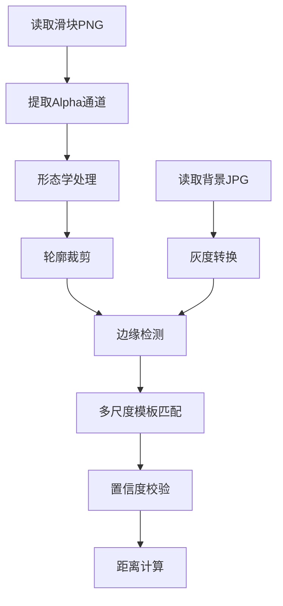

# `card.xjtu.edu.cn` 场地获取记录

一些特征信息：
- 一楼羽毛球场：
    - `stock` 中为 {"336456":"1"}
    - `address = 41`
    - `stockdetailids` 来自于 `area.get("id")` （见getOKArea.py）
- 三楼羽毛球场：
    - `stock` 中为 {"336323":"1"}
    - `address = 42`
    - `stockdetailids` 来自于 `area.get("id")` （见getOKArea.py）

一个典型的payload为：
```json
{
    "stock": {
        "336456": "1" # 一楼羽毛球场
    },
    "istimes": "1",
    "address": "41", # 一楼羽毛球场
    "stockdetailids": "3372030" # 用来指示具体的场地（时间段、场地号）
}
```


## 登录: 获取`SESSION` cookie

### 登录流程：
1. **初始化访问**  
   访问`http://card.xjtu.edu.cn/`页面并点击"场馆预定"按钮，触发以下元素事件：
   ```html
   <a onclick="goPage(510,1,476,'场馆预订','',4,'http%3a%2f%2f202.117.17.144%2fxjtu%2fcas%2flogin.html','场馆预订','',0,'1')"></a>
   ```

2. **首次重定向**  
   发起`GET`请求至`http://202.117.17.144/xjtu/cas/login.html`，返回`302`状态码并重定向至：
   ```
   http://org.xjtu.edu.cn/openplatform/oauth/authorize
   ```
   响应头中获取关键Cookies：
   - `JSESSIONID`
   - `SESSION`

3. **认证初始化**  
   请求授权端点（携带认证参数）：
   ```
   GET http://org.xjtu.edu.cn/openplatform/oauth/authorize
   ?appId=1439
   &redirectUri=http://202.117.17.144/xjtu/cas/oauth2url.html
   &responseType=code
   &scope=user_info
   &state=1
   ```
   响应头返回关键Cookie：
   - `route=54ab5ff9cad12ae10a8dd7f8626222f8`  
     （注：此Cookie来源尚未明确，需后续跟踪）

   同步设置以下Cookies：
   ```http
   Set-Cookie: statesuccess=; Max-Age=0
   Set-Cookie: app_info_urla=; Max-Age=0
   Set-Cookie: rdstate=1; Domain=org.xjtu.edu.cn; Path=/
   Set-Cookie: cur_appId_=k7wbyj6/cOM=; Domain=org.xjtu.edu.cn; Path=/
   Set-Cookie: state=xjdCas; Domain=org.xjtu.edu.cn; Path=/
   ```

4. **加载登录页面**  
   请求`GET http://org.xjtu.edu.cn/openplatform/login.html`返回`200`，加载登录表单及相关静态资源。

5. **提交认证凭证**  
   发起认证`POST`请求至：
   ```
   POST http://org.xjtu.edu.cn/openplatform/g/admin/login.html
   ```
   **请求参数**：
   ```json
   {
     "loginType": 1,
     "username": "<YOUR_USERNAME>",
     "pwd": "<AES_ENCRYPTED_PASSWORD>",
     "jcaptchaCode": "<CAPTCHA>"
   }
   ```
   **Cookie上下文**：
   ```http
   Cookie: route=54ab5ff9cad12ae10a8dd7f8626222f8
   Cookie: rdstate=1
   Cookie: cur_appId_=k7wbyj6/cOM=
   Cookie: state=xjdCas
   Cookie: JSESSIONID=07143264D656DE70511DA63033E5F6C3
   Cookie: sid_code=workbench_login_jcaptcha_07143264D656DE70511DA63033E5F6C3
   ```

   > **密码加密规范**，具体见[密码加密操作](#password加密操作)部分。
   > 使用AES-ECB模式加密，配置参数：
   > - Key: `0725@pwdorgopenp` (UTF-8编码)
   > - 填充方案: PKCS7
   > - 输出格式: Base64字符串

6. **处理认证响应**  
   成功响应（`200`）返回结构：
   ```json
   {
     "code": 0,
     "message": "成功",
     "data": {
       "pwdState": "1",
       "tokenKey": "user_token_5fe9a484-49d0-4ae2-a95c-ca0436fbcf35",
       "orgInfo": {
         "orgId": 1000,
         "orgName": "西安交通大学",
         "memberId": 840441,
         "isIdentification": 1
       },
       "state": "xjdCas"
     }
   }
   ```
   **关键参数**：
   - `tokenKey`: 后续请求的认证令牌
   - `memberId`: 用户标识ID

7. **获取授权码**  
   请求OAuth回调端点：
   ```
   GET http://org.xjtu.edu.cn/openplatform/oauth/auth/getRedirectUrl
   ?userType=1
   &personNo=<STUDENT_ID>
   &_=<TIMESTAMP>
   ```
   **Cookie上下文**新增：
   ```http
   Cookie: open_Platform_User=user_token_5fe9a484-49d0-4ae2-a95c-ca0436fbcf35
   Cookie: memberId=840441
   ```

8. **完成OAuth流**  
   响应返回重定向地址：
   ```json
   {
     "code": 0,
     "message": "成功",
     "data": "http://202.117.17.144/xjtu/cas/oauth2url.html?code=oauth_code_190e6e8...&state=1&userType=1&employeeNo=<STUDENT_ID>"
   }
   ```
   最终请求该URL完成登录，获取有效`SESSION` Cookie。

9. 补充说明：

    - 在第7、8步中，首先是第七步请求的响应会返回两个cookies，分别是`usertypekey=1` 和 `employeeNo=<STUDENT ID>`，这两个cookies在后续几乎没有用处。
    - 在第8步中，对于重定向后的`url`的请求的响应会返回一个新的cookies：`JSESSIONID`，然而在后续实际操作中，这个cookies并没有用处，并且会在请求`http://202.117.17.144/index.html`时再次被重新给一个值，所以记录是不必要的。只有`SESSION`是唯一重要的。
    - 第7、8步可以发现是为了获取最后的`http://202.117.17.144/index.html`页面，而这个页面是我们最终想要的页面，因此在实际操作中，我们可以直接跳过这两步，直接请求`http://202.117.17.144/index.html`页面。

### `password`加密操作：

在登录流程中的第5步中，需要对密码进行加密操作，通过观察登录页面的JavaScript代码，密码输入后，点击`<div class="login_btn account_login" id="account_login">登录</div>`按钮，触发`account_login`事件，调用`getPublicKey()`函数，而该函数中包含了密码加密的逻辑：
```javascript
# AES加密配置 幽默XJTU，登录界面公钥硬编码 XD
function getPublicKey() { //  2 IE兼容
  var publicKey = '0725@pwdorgopenp';  // 定义key
  // 密码进行 AES 加密
  var pwdVal = $('.pwd')[1].value || $('.pwd')[0].value;
  var encrypts = CryptoJS.AES.encrypt(pwdVal, CryptoJS.enc.Utf8.parse(publicKey), {
    mode: CryptoJS.mode.ECB,
    padding: CryptoJS.pad.Pkcs7
  }).toString();
  var params = {
    'loginType': 1,  // 登录方式
    'username': $('.username')[1].value || $('.username')[0].value,
    'pwd': encrypts,  // 加密后的密码
    'jcaptchaCode': $('.text_yan')[1].value || $('.text_yan')[0].value  // 验证码
  };
  login(params);
}
```


## 场地信息获取

场地查询的逻辑有两个：
1. 通过`POST`请求`http://202.117.17.144/order/show.html?id=41`，payload中包含`stock`、`istimes`、`address`、`stockdetailids`参数，此时返回的html页面中包含了空闲场地的信息：
    - 依赖`SESSION` Cookie，也就是需要先登录获取`SESSION` Cookie。
    - 只能在8:40-21:40之间查询，否则会返回`{"code":1,"message":"不在预定时间内"}`。
    - 解析困难
2. **通过`GET`请求`http://202.117.17.144/product/findOkArea.html`**，参数为`s_date`、`serviceid`、`_`，其中`serviceid`为`41`或`42`，`s_date`为日期，`_`为当前时间戳（不必要），返回的json数据中包含了所有可见场地的信息：
    - 无需登录
    - 可以查询任意日期的场地信息
    - 返回的数据格式为json，解析简单

因此，这里选择第二种方式进行场地查询。


## 场地预定

### 场地详情界面预定

在当前界面，选择场地后点击“确认预定”按钮，触发以下事件：
```html
<button class="normal-button-mid button-danger" id="reserve" onclick="applySeat();">确认预订</button>
```

调用`applySeat()`函数，该函数中包含了预定的逻辑：
```javascript
function applySeat() {
    var num = Number($("#sum").text());
    if (num > 0) {
        if ($("#cr").length > 0) {
            if (!$("#cr").is(":checked")) {
                info('请阅读说明后预订！');
                return false;
            }
        }

        loadding();
        // loadInfo("锁定座位", "正在为您锁定座位.....请勿刷新页面！");
        var model = {};
        if ($("#shoptype").find(".active").data('type') == 'day') {
            var stock = {};
            var seatid = [];
            $('#seatshow').find('.ticket-auto').each(function (i, k) {
                seatid.push($(k).attr('data-did'));
                stock[$(k).attr('data-stockid')] = (stock[$(k).attr('data-stockid')] == null ? 1 : Number(stock[$(k).attr('data-stockid')]) + 1) + '';
            })
            model.stock = stock;
            model.istimes = '1';
            model.address = $('#serviceid').val();
            model.stockdetailids = seatid.join(',');
        } else {
            model.dates = $('#yd_date').val();
            var time_detailname = [];
            $('#seatshow').find('.ticket-auto').each(function (i, k) {
                time_detailname.push($(k).data('timer') + '_' + $(k).data('dname'));
            })
            model.time_detailnames = time_detailname.join(',');
            if ($("#shoptype").find(".active").data('type') == 'month') {
                model.flag = '1';
            } else {
                model.flag = '2';
            }
            model.serviceid = $('#serviceid').val();
        }

        if ($("#shoptype").find(".active").data('type') == 'day') {

            var param = {};
            param.serviceid = $('#serviceid').val();
            param.num = seatid.length;
            param.date = $('.date-week').find('li.active').attr('data');
            //AjaxGet('/order/booklimt',param,function(o){
            //	if(o.result == 1){
            //		$('#param').val(JSON.stringify(model));
            //		$('#form1').submit();
            //	}else{
            //		info(o.message);
            //	}
            //},'json');

            $('#param').val(JSON.stringify(model));
            $('#form1').submit();
        } else {
            $('#param').val(JSON.stringify(model));
            $('#form1').submit();
        }


        // alert(JSON.stringify(model));


    } else {
        info("请选择需要预订的" + typename + "信息！");
    }

}
```

### `/order/show.html?id=41`

```html
<button class="button-large button-info" id="reserve" onclick="goonreserve();event.returnValue=false;">确认预订</button>
```

调用`goonreserve()` -> `yzmWindow()` -> `loaddingWhite()` -(yzm)-> `createOrder(yzm)` -> `goonreserve(yzm)`

1. **`goonreserve()`** 函数调用 `yzmWindow()`，它会弹出一个加载动画和验证码。
2. **`loaddingWhite()`** 函数展示了一个带有白色背景的遮罩层，并在其中嵌入了一个 `iframe`，这个 `iframe` 会加载 `/yzm/slider.html` 页面，这是验证码界面。
3. 页面上会显示一个加载动画，直到用户完成验证码的输入。
4. 完成后会`createOrder(yzm)`，其中`yzm`为滑块验证码验证时的一系列信息，再次调用`goonreserve(yzm)`，

### Captcha

1. `/order/show.html?id=41` 
2. `/yzm/slider.html`
3. `/gen`
4. `http://202.117.17.144:8071/check?id=44430f2ddc6e4c15915bf33eedc40158` : 从这里开始验证，这是一个post请求，payload为滑块验证码的信息
* var yzm = JSON.stringify(data)+'synjones'+currentCaptchaId+'synjones'+url

